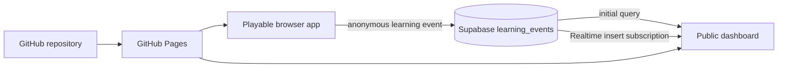

# Let's Play Language

**Let's Play** is an open-source, game-based language-learning prototype designed to help children build early Arabic literacy through visual block-building, guided tracing, listening, speaking, and picture-selection activities.

This repository contains a playable Level 1 prototype, its dashboard interface, source assets, and the database schema for the minimally live analytics implementation.

## Public links

- **Repository:** https://github.com/letsplaylanguage/lets-play-language
- **Playable prototype:** https://letsplaylanguage.github.io/lets-play-language/
- **Dashboard:** https://letsplaylanguage.github.io/lets-play-language/dashboard/

> GitHub Pages links become active after Pages is enabled for the `main` branch.

## Eligibility status

| Gate | Status | Evidence |
|---|---|---|
| Public open-source repository | In progress | Repository created publicly; initial source commit is the next step |
| Publicly playable prototype | In progress | Static source is included and ready for GitHub Pages |
| Minimally live dashboard | Not yet complete | Current dashboard is explicitly staged; Supabase integration is the next implementation step |

The dashboard must not be described as live until app-generated events are stored in Supabase, persist across refreshes, and appear in the public dashboard.

## What is implemented

- Responsive mobile-style Level 1 prototype
- Functional login fields for demonstration
- Onboarding and lesson navigation
- Drag-and-drop letter construction
- Guided tracing activity
- Listening, microphone-selection, and picture-choice exercises
- Dashboard button beside Restart
- Side-by-side dashboard panel
- Static deployment with no build step

## Repository structure

```text
.
├── index.html                 # Public entry point; opens the prototype
├── src/                       # Playable application
│   ├── index.html
│   ├── css/style.css
│   ├── js/app.js
│   └── assets/
├── dashboard/                 # Dashboard interface
├── supabase/                  # Live-event schema and setup guide
├── docs/                      # Architecture, privacy, deployment and audit docs
├── LICENSE                    # MIT license for source code
├── ASSET_LICENSE.md           # Artwork and asset terms
├── CONTRIBUTING.md
├── CODE_OF_CONDUCT.md
├── SECURITY.md
└── TEAM.md
```

## Run locally

No package manager or build process is required.

```bash
python3 -m http.server 8000
```

Then open:

```text
http://localhost:8000/
```

Directly opening `index.html` also works in many desktop browsers, but serving the folder is more reliable for mobile testing and embedded dashboard behavior.

## Architecture



The planned live event model intentionally excludes names, email addresses, recordings, exact age, and other child-identifying information.

See:

- [Architecture](docs/ARCHITECTURE.md)
- [Data and privacy](docs/PRIVACY.md)
- [Deployment](docs/DEPLOYMENT.md)
- [Eligibility evidence checklist](docs/ELIGIBILITY_CHECKLIST.md)
- [Supabase setup](supabase/README.md)

## Current dashboard state

The dashboard under `dashboard/` currently demonstrates the intended visual experience using locally generated values. It is **not yet a real-data implementation**. The next milestone replaces the generator with:

1. A persisted `learning_events` table
2. Anonymous browser inserts from the app
3. An initial dashboard query
4. A Supabase Realtime subscription
5. A visible connected/disconnected indicator

## Contributing

See [CONTRIBUTING.md](CONTRIBUTING.md). Contributions should preserve Arabic text direction, accessible interaction targets, mobile usability, and the repository's privacy constraints.

## Licensing

Source code is released under the [MIT License](LICENSE). Artwork, branding, Adobe XD exports, audio, and other creative assets are governed separately by [ASSET_LICENSE.md](ASSET_LICENSE.md).
